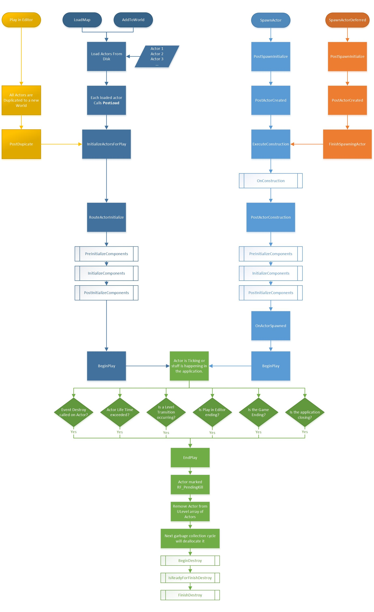

## 命名规则
模板类 前缀 **T**  
继承自UObject **U**  
继承自AActor **A**  
继承自Swidget **S**
抽象借口 **I**  
Enums **E**  
Boolean变量 **b**  
其他类 **F**
TypeDef根据类型选择 **U** 或者 **F**

避免缩写

返回bool类型的函数需要是一个询问状态的名字，例如IsVisiable()  

没有返回值的函数（procedure），需要用一个目的明确的动词开始（一个动宾结构）。  

建议函数参数如果是引用类型，前缀标记为 **Out**  

## Portable Aliases for Basic C++ Types
* bool for boolean values (NEVER assume the size of bool). BOOL will not compile.
* TCHAR for a character (NEVER assume the size of TCHAR).
* int8 for signed bytes (1 byte).
* uint8 for unsigned bytes (1 byte).
* uint16 for unsigned "shorts" (2 bytes).
* int16 for signed "shorts" (2 bytes).
* uint32 for unsigned ints (4 bytes).
* int32 for signed ints (4 bytes).
* uint64 for unsigned "quad words" (8 bytes).
* int64 for signed "quad words" (8 bytes).
* float for single precision floating point (4 bytes).
* double for double precision floating point (8 bytes).
* PTRINT for an integer that may hold a pointer (NEVER assume the size of PTRINT).  

## 通用格式
很多个的条件判断，单独拿出来用临时变量表示  

继承类的虚函数如果需要override，在函数后记得标注overrides  

用FType\* P 而不是FType \*P

## UE4智能指针库
- Shared Pointer(TSharedPtr)
- Shared Reference(TSharedRef)
- Weak Pointer(TWeakPtr)

优点：
+ 当没有引用后，自动释放
+ 有线程安全的方法
+ 运行时安全 Shared Reference不会为空
+ 不会有引用循环，用Weak Pointer来避免循环引用
+ 能明确Object的Owner

所有的Shared类型(TSharedPtr, TSharedRef, TWeakPtr)（32bits指针）8bytes，包含
- c++ pointer(uint32)
- Reference controller pointer(uint32)  

Reference controller object 12bytes (32bits指针)
- c++ pointer(uint32)
- Shared reference count (uint32)
- Weak reference count (uint32)

Shared Reference是非空的Shared Pointer，任何时候Shared Reference不会为空，也就不需要IsValid()函数。如果可行的话，建议总是使用Shared Reference代替Shared Pointer。如果你需要空指针，那么用Shared Pointer。

TSharedRef转TSharedPtr隐式转换，TSharedPtr转TSharedRef需要显示转换ToSharedRef()。

Weak Pointer的引用不会阻止object的释放。Weak Pointer会自动置为空，当Object释放之后。可以用Weak Pointer来确定Object有没有被销毁。   

## Actor
### Spawn Actor
主要通过`UWorld::SpawnActor()`创建一个Actor的实例，并返回指针
### Components  
actor相当于包含多个components的容器  
actor的Transfrom取决于 root component  
### Ticking
#### Tick Group
tick group决定什么时间进行tick，最主要的就是physics simulation。Group主要分为物理前，物理中，物理后（=。=）。
#### Tick Dependency
通过`AddTickPrerequisiteActor `和`AddTickPrerequisiteComponent `设置相应的Actor或Component，只有在对应的Actor或者Component的tick结束后，当前的Actor才会进行tick。
### LifeCycle
  

### Destroy
actor并不会自动垃圾回收，需要调用Destroy()函数

## Delegates机制
先mark
## UPROPERTY
- Meta = (Bitmask)  
将整数声明为bitmask，通过下来菜单选择Flag1，Flag2等等  
如果想要自定义flag名称，我们需要创建一个UENUM，包含bitflags meta属性
```
UENUM(Meta = (Bitflags))
enum class EColorBits
{
    ECB_Red,
    ECB_Green,
    ECB_Blue
};
```  
然后
```
UPROPERTY(EditAnywhere, Meta = (Bitmask, BitmaskEnum = "EColorBits"))
int32 ColorFlags;
```
- boolean Type
有两种形式
```
uint32 bIsHungry : 1;
bool bIsThirsty;
```
- string类型
UE4支持3中字符串形式，FString是一个动态char数组，可以动态修改，FName是不可变的创建在全局字符串表的字符串，内存更小，更高效，FText是一个更鲁棒的字符串主要处理用户定义数据字符。
TEXT()宏可以用来处理TCHAR的类型转换

- Properties
参考[link](https://docs.unrealengine.com/latest/INT/Programming/UnrealArchitecture/Reference/Properties/index.html)。

## TArray
Arr.Add();  
Arr.Emplace();  
Add将参数拷贝一份作为Instance，也就是创建一个空的instance，然后将参数拷贝（默认构造函数+拷贝）（Push和Add用途完全一致）  
Emplace直接利用参数创建一个instance（带参数的构造函数）  
通常情况下，Emplace比Add要好，能够避免创建不必要的临时变量。不重要的例如int32用Add，非平凡的如FString用Emplace  

**Append** 允许在array后添加多个元素，从另外一个array中。  
- **迭代**  
推荐使用C++'s ranged-for的特性
```
FString JoinedStr;
for (auto& Str : StrArr)
{
    JoinedStr += Str;
    JoinedStr += TEXT(" ");
}
```
也可以用数组的index进行访问，也可以使用Array的迭代器类型。  
- **排序**  
Sort(), HeapSort()根据数据量、需求进行选择，两者都是不稳定排序，Sort()也可以自定义比较函数。  
StableSort()稳定排序  
- **query 查询 精确的信息检索**  
GetData()返回指针，如果const数组，则返回const指针  
[]返回引用，如果const数组，则返回const引用  
Last() Top() Last(1)，从尾部的检索，Top和Last一样，Last额外可以加index参数  
bool bIsTrue = Contains()检索数组是否包含某元素  
int Index = Find()  
